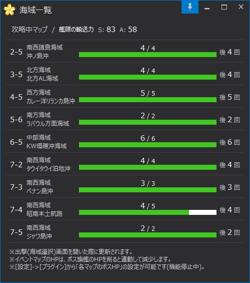

MapHP Plugin
================

KanColleViewer で、攻略中マップのHPと最低必要撃破回数を一覧表示するプラグインです。

* イベント海域では、マップHPとゲージ破壊に最低限必要なボス撃破回数を表示します
* 通常海域では、必要なボス撃破回数と現時点での残り撃破回数を表示します
* 「艦これ戦術データリンク」からデータ取得を行っています

### インストール

* `EventMapHpViewer.dll` を KanColleViewer の `Plugins` ディレクトリに放り込んで下さい。

### ライセンス

* [The MIT License (MIT)](LICENSE)

### 使用ライブラリ

#### [KanColleViewer](https://github.com/Grabacr07/KanColleViewer)

> The MIT License (MIT)
> 
> Copyright (c) 2013 Grabacr07

* **ライセンス :** The MIT License (MIT)
* **ライセンス全文 :** [licenses/KanColleViewer.txt](licenses/KanColleViewer.txt)